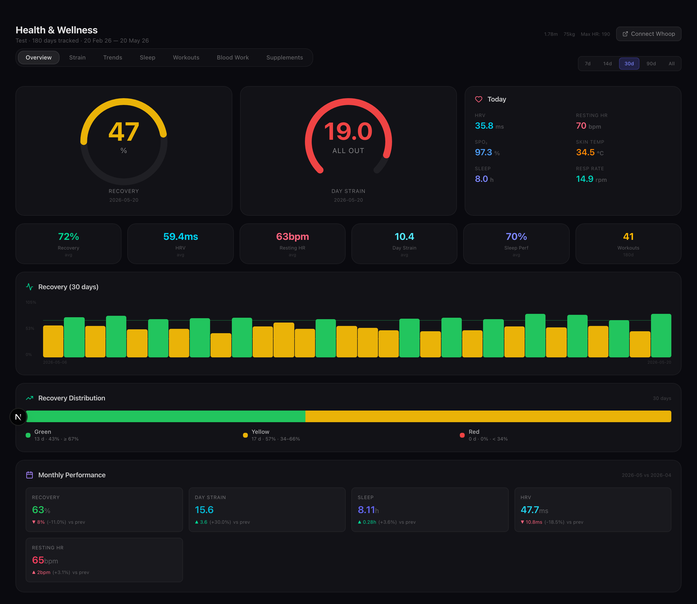
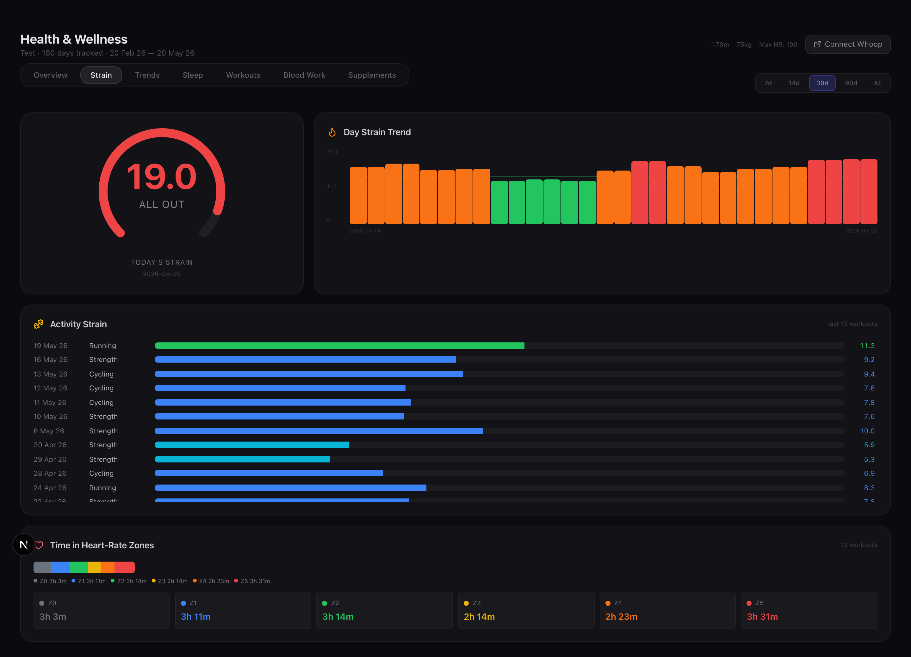
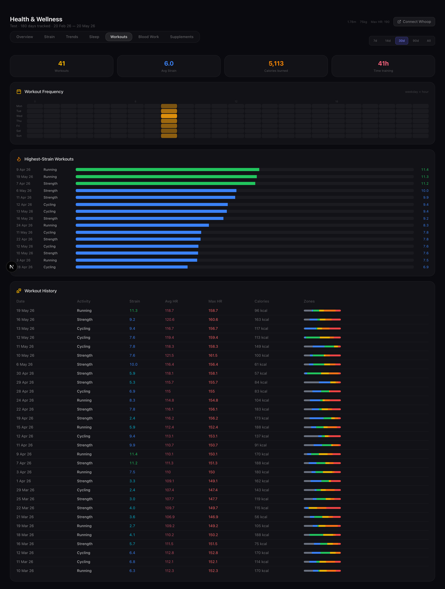
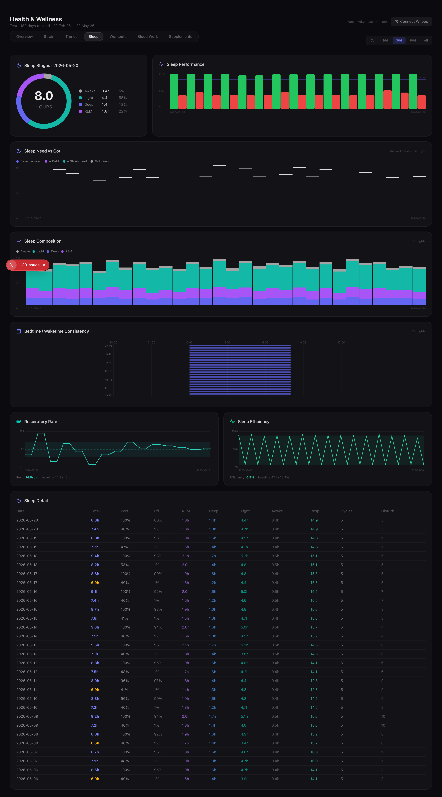
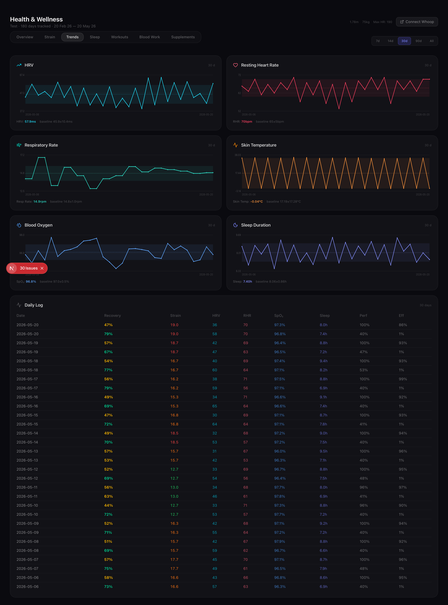
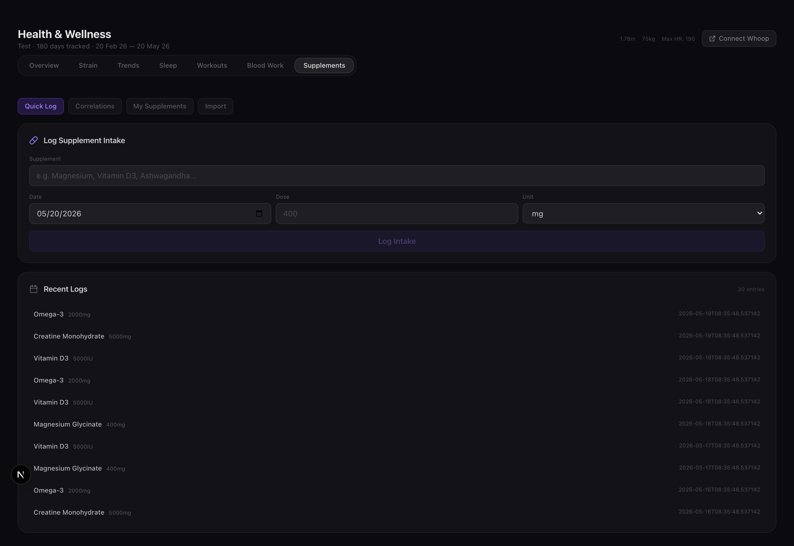

# openclaw-biohub

**Your wearables, labs, and supplements — one place, on your hardware.**

A self-hosted personal-health hub for [OpenClaw](https://docs.openclaw.ai/)
and adjacent quantified-self setups. Pulls biometric data from wearables,
parses your blood-panel PDFs, tracks your supplement stack, ships a
Next.js dashboard, and gives your agent a `SKILL.md` for grounded
wellness coaching.



Tracks **recovery score, HRV (rmssd), resting heart rate, SpO₂, skin
temperature, sleep stages (REM / deep / light), sleep efficiency, daily
strain, workouts with HR zones, body composition, glucose / CGM,
blood-panel biomarkers** (with reference-range flagging), and
**supplement intake with lag-aware partial-correlation analysis** against
recovery and HRV. Includes an ML pattern engine (Pearson correlations,
IsolationForest anomaly detection, linear-regression recommendations).

> ⚠️ **Not medical advice.** See [DISCLAIMER.md](DISCLAIMER.md).

<details>
<summary>More screenshots</summary>

### Strain & workouts




### Sleep



### Trends



### Supplements



(All screenshots above are rendered against `fixtures/seed.py --source all` —
no real biometric data. Run `OPENCLAW_BIOHUB_HOME=$PWD/.local-data
python3 fixtures/seed.py --source all` then `npm run dev` to reproduce.)

</details>

## Available adapters

| Slug | Source | Auth | Stability | Real-device validated? |
|------|--------|------|-----------|------------------------|
| `whoop` | WHOOP | OAuth 2.0 + systemd handler | **stable** | ✅ yes (the maintainer's own device) |
| `oura` | Oura Ring | Personal Access Token | stable | ❌ fixtures only |
| `fitbit` | Fitbit | OAuth 2.0 + localhost callback | stable | ❌ fixtures only |
| `apple-health` | Apple Health | File watch (no API) | stable | ❌ fixtures only |
| `garmin` | Garmin Connect | username + password (via `garth`) | **EXPERIMENTAL** | ❌ fixtures only |

All five adapters write to source-specific raw SQLite databases and roll
up into a source-agnostic `daily_metrics` table that the dashboard and
agent query. Adding another (Polar, Withings, Whoop+CGM, …) is a matter
of dropping a new folder into `pipeline/adapters/` and registering it in
`biohub/registry.py` — see [CONTRIBUTING.md](CONTRIBUTING.md).

### 🔍 Help wanted: device validators

The four non-WHOOP adapters were built end-to-end from public API docs
and validated against captured fixture JSON, but **nobody has run them
against a real device yet**. If you own one of these and would like to
help shake out the edge cases the docs don't show:

1. `pip install -e .[analytics]` from the repo root.
2. `biohub connect <slug>` and follow the prompts (each adapter prints
   the provider's developer-portal URL and the exact steps).
3. `biohub sync <slug>` — does it pull data? Do the row counts look
   right? Does `biohub list-adapters` still show your adapter as
   configured after a restart?
4. Open an issue at
   <https://github.com/maxnau89/openclaw-biohub/issues> with the label
   `device-validation`, the adapter slug, and either *"works for me"*
   plus your watch model/firmware OR a sanitized API response and a
   description of what the adapter mis-parsed.

The two outputs I most need from validators: **(a)** "the OAuth/PAT
flow works on a real account in 2026, end-to-end" and **(b)** any field
the adapter writes as `NULL` that your provider *does* return — that
means the schema is missing a column the rollup could use. See
[CONTRIBUTING.md](CONTRIBUTING.md#filing-a-device-validation-report)
for the full report template.

## What's in the box

| Piece | Purpose |
|------|---------|
| **`biohub/`** | `biohub` CLI (installable via `pip install -e .`). Discovers adapters, runs `connect` wizards, drives syncs. |
| **`pipeline/adapters/`** | One subdir per device source. Each adapter subclasses `BiometricAdapter` (see `pipeline/adapters/base.py`) and implements the same four-method lifecycle. |
| **`pipeline/`** | Source-agnostic helpers: blood-panel PDF parser, biomarker + supplement analytics, ML pattern engine, shared path resolution, OAuth helpers. |
| **`dashboard/`** | Next.js 16 / React 19 dashboard with recovery, sleep, strain, blood-work, and supplement tabs. Reads from `daily_metrics` — source-agnostic. |
| **`agent/`** | OpenClaw "wellness coach" persona files + `SKILL.md` for ClawHub publishing. |
| **`systemd/`** | `whoop-oauth-handler.service` unit + `secrets.env.example`. |
| **`db/schema.sql`** | `health.db` schema (`daily_metrics`, blood, supplements, nutrition). Each adapter's raw schema lives in `pipeline/adapters/<slug>/schema.sql`. |
| **`db/migrate_v0.1_to_v0.2.py`** | Idempotent migration script — see [CHANGELOG.md](CHANGELOG.md). |
| **`fixtures/`** | `seed.py` produces 90 days of deterministic synthetic data so you can poke at the system before connecting real devices. |

## Five-minute quickstart

Prerequisites: Python 3.11+, Node 20+, `sqlite3`.

```bash
# 1. Clone + install
git clone https://github.com/YOUR_USER/openclaw-biohub
cd openclaw-biohub
python3 -m venv .venv
source .venv/bin/activate
pip install -e .[analytics]
export OPENCLAW_BIOHUB_HOME=$PWD/.local-data

# 2. See what's available
biohub list-adapters

# 3. Seed synthetic data (so the dashboard has something to render)
python3 fixtures/seed.py

# 4. (Optional) Connect a real device — e.g. Oura
biohub connect oura

# 5. Start the dashboard
cd dashboard
npm install
npm run dev
# → open http://localhost:3000 (auto-redirects to /health)
```

Adapter-specific setup details live in
[CONFIGURATION.md](CONFIGURATION.md); each `biohub connect <slug>` also
prints the relevant developer-portal URL and walks you through the
credential capture interactively.

## What the dashboard shows

- **Recovery** — recovery score, HRV (rmssd), resting HR, SpO₂, skin temp.
- **Strain** — daily strain, workout strain, calories, HR zones.
- **Sleep** — duration, performance %, efficiency %, REM / deep / light, consistency.
- **Trends** — 7-day, 30-day, 90-day baselines and deltas.
- **Blood work** — biomarker time series, reference-range flagging.
- **Supplements** — intake log + Pearson correlation against recovery / HRV
  (lag-aware, controlling for sleep and strain).

The optional `health-insights` endpoint runs `whoop_pattern_engine.py`
which does pairwise Pearson correlations, IsolationForest anomaly
detection, and linear-regression recommendations.

> Note: the pattern engine is still WHOOP-shaped (queries `whoop_raw.db`).
> Making it source-agnostic is a v0.3 item — see [CHANGELOG.md](CHANGELOG.md).

## Project layout

```
openclaw-biohub/
├── biohub/                       # CLI package
│   ├── cli.py                    # argparse subcommands
│   └── registry.py               # adapter discovery
├── pipeline/
│   ├── adapters/
│   │   ├── base.py               # BiometricAdapter ABC
│   │   ├── _oauth_helpers.py     # shared OAuth 2.0 primitives
│   │   ├── whoop/                # WHOOP adapter
│   │   ├── oura/                 # Oura adapter
│   │   ├── fitbit/               # Fitbit adapter
│   │   ├── apple_health/         # Apple Health adapter
│   │   └── garmin/               # Garmin adapter (EXPERIMENTAL)
│   ├── whoop_pattern_engine.py   # ML analytics over whoop_raw.db
│   ├── parse_blood_panel.py      # lab PDF parser
│   ├── blood_marker_analytics.py
│   ├── supplement_analytics.py
│   ├── fix_blood_markers.py
│   ├── paths.py                  # env-driven path resolution
│   └── requirements.txt
├── dashboard/                    # Next.js dashboard
├── agent/                        # OpenClaw wellness-coach persona + SKILL.md
├── systemd/                      # WHOOP OAuth handler service
├── db/
│   ├── schema.sql                # health.db schema
│   └── migrate_v0.1_to_v0.2.py   # one-shot migration
├── fixtures/                     # seed.py + sample blood panel
├── tests/                        # 98 pytest tests
├── pyproject.toml                # package + biohub script
├── CHANGELOG.md
└── .github/workflows/ci.yml
```

## Adding a new device adapter

See [CONTRIBUTING.md](CONTRIBUTING.md) — the four-method
`BiometricAdapter` interface, the adapter-owned `schema.sql` pattern,
the registry registration, and what fixtures + tests are expected.

## How it fits with OpenClaw

If you run [OpenClaw](https://github.com/openclaw) (or another agent
harness):

1. Drop `agent/` into your agent definitions directory.
2. Customize `agent/USER.md` (your name, baselines, notification preferences).
3. Point `OPENCLAW_BIOHUB_HOME` at where the DBs and credentials live.
4. The agent reads from `health.db` (source-agnostic) via the queries
   documented in `agent/AGENTS.md` and `agent/SKILL.md`.

The dashboard and agent are independent — you can use either alone.

## Status

`v0.2.0-dev` — five adapters wired, the CLI is in. The schema (now
`daily_metrics` with a `source` column) is expected to stay stable
from here.

See [CHANGELOG.md](CHANGELOG.md) for what changed since v0.1.

## License

[MIT](LICENSE).
